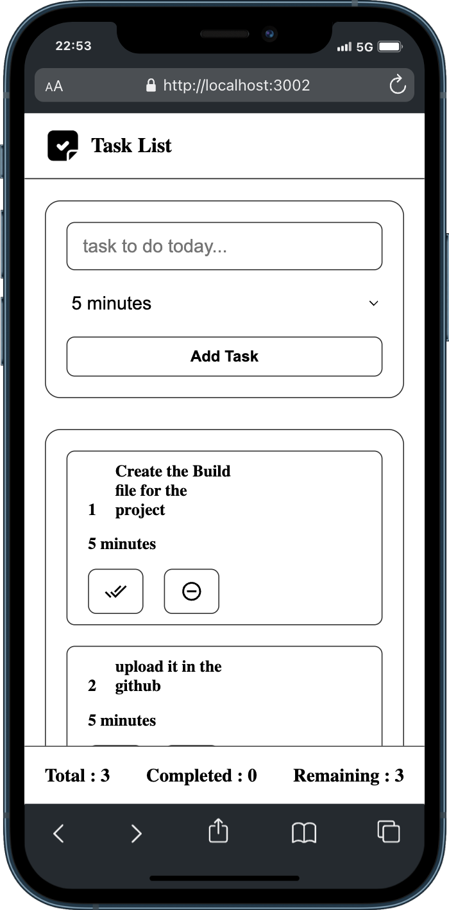
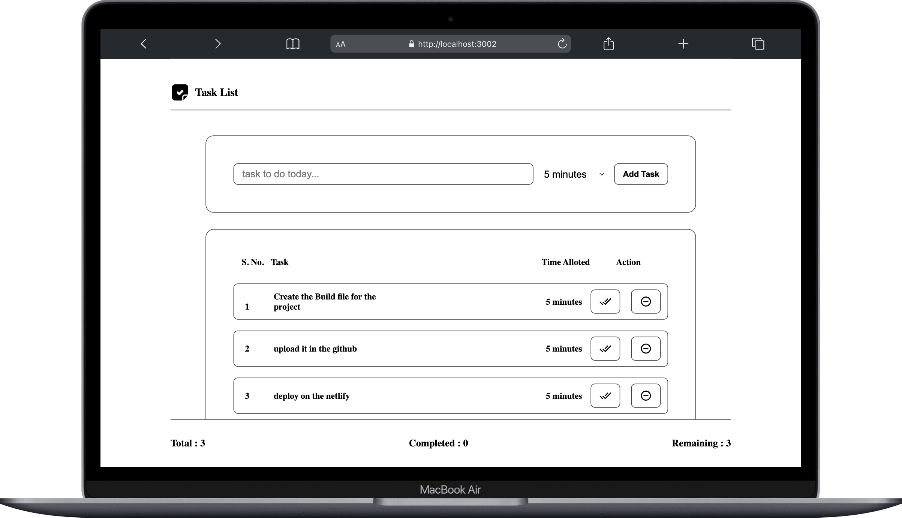

# My Day Planning 🗓️

**My Day Planning** is a simple, intuitive, and minimalistic day planner built with React. It helps users organize their daily tasks efficiently while maintaining a clean and user-friendly interface. The app supports persistent task storage, allowing users to revisit and manage their tasks seamlessly.

---

## Live View :

Link : https://my-day-planning.netlify.app/

---

## ✨ Features

- **Minimalistic Design**: Clean and distraction-free interface for easy task management.
- **Task Management**: Add, edit, mark as completed, or delete tasks effortlessly.
- **Persistent Data**: Tasks are stored locally using browser storage, ensuring they remain available between sessions.
- **Responsive Design**: Works flawlessly on desktops, tablets, and mobile devices.
- **Real-Time Updates**: Updates dynamically as you interact with the app.

---

## 🛠️ Technologies Used

- **React**: For building the UI components.
- **React Hooks**: To handle component state and side effects.
- **Local Storage**: To persist tasks between sessions without relying on external databases.
- **CSS Modules**: For clean and modular styling.

---

## 📸 Screenshots

**Mobile View**

**Desktop View**


---

## 🚀 Getting Started

Follow these steps to run the project locally:

### Prerequisites

Ensure you have the following installed:

- [Node.js](https://nodejs.org/) (LTS version recommended)
- npm (comes with Node.js)

### Installation

1. Clone this repository:
   ```bash
   git clone https://github.com/your-username/my-day-planning.git
   ```
2. Navigate to the project directory
   ```bash
   cd my-day-planning
   ```
3. Install the dependencies:
   ```bash
   Copy code
   ```
4. Start the development server:
   ```bash
   npm start
   ```
5. Open your browser and visit http://localhost:3000 to view the app.

### 🤝 Contributing

Contributions are welcome! If you have suggestions or find issues, feel free to:

Open an issue on the Issues page.
Fork the repo and submit a pull request.

### ⭐ If you find this project helpful, consider giving it a star! ⭐

```bash
   Let me know if you need further edits! 😊
```
